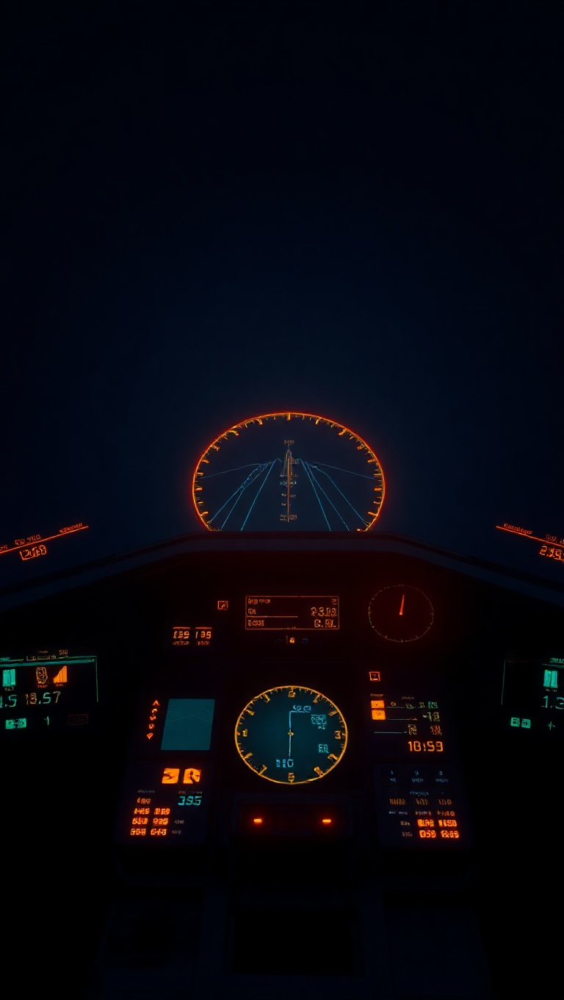

# ✈️ Flight Ops

**Run a small aircraft company: design planes in the hangar, take cargo contracts, fly risky missions, and open the Aero Lab to solve real potential-flow aerodynamics live on your phone.**

Flight Ops is a cross-platform game built with React Native + Expo. There's no backend and no account — the whole game runs on your device. It also ships a real computational-aerodynamics workbench (panel method, Cp, CL, Theodorsen, Wagner) as an in-game tab.

---

## 🎮 Play the Game

> ⚠️ There is **no hosted live demo yet** — nothing is deployed. The two fastest ways to try it:

### 1. Web — easiest, works on any desktop or mobile browser

```bash
npm install
npm run web
```

A browser tab opens at `http://localhost:8081` with the full game.

### 2. Phone — with the Expo Go app

1. Install **Expo Go** from the App Store (iOS) or Play Store (Android).
2. Run `npx expo start` in the project folder.
3. Scan the QR code shown in the terminal with your phone (same Wi-Fi network).

**Works on:** iOS · Android · Web (desktop & mobile browsers).

---

## 📸 Demo

*In-app artwork used by the current build (live UI screenshots are coming — the Aero Lab was added most recently).*

| | |
|---|---|
|  |  |

---

## 🕹️ How to Play

**The loop:** pick a contract → build an aircraft for it → fly the mission → get paid (or not) → buy upgrades → repeat with harder jobs.

1. **Contracts** tab — choose a cargo job: payload (kg), distance (km), reward (£M) and difficulty. Hit the refresh icon for new jobs.
2. **Hangar** tab — assemble your aircraft from wings, engine and fuel. The sim instantly recomputes **build cost, fuel range, safety, reliability and reserve**. Launch only when you can afford the build cost — you *can* launch a vehicle that can't make the distance, but the mission briefing will warn you.
3. **Mission** — tap **Begin Mission**, then **Advance Flight** to fly in stages. Every stage burns fuel and rolls for random events (weather, faults, surprises) weighted by your aircraft's reliability. Event cards give you choices that change **fuel, airframe integrity and engine health**.
4. **Result** — deliver the payload for the full reward, or lose it. **Net = reward − build cost.** Missions earn XP toward your company.

**You lose a mission if** fuel runs out, integrity hits zero, the engine fails, or you abort. Watch for the chain reaction: damaged engines burn more fuel.

**Company** tab — spend earnings on upgrades. The **AI co-pilot** upgrade unlocks hints on event cards.

---

## ✨ Features

- 🛠️ **Design-to-mission loop** — parts change real flight physics (range, burn rate, safety, reliability).
- 🎲 **Deterministic, seed-based missions** — every contract's events replay identically; no hidden randomness surprises.
- 🧑‍✈️ **Choice-driven flight events** with meaningful trade-offs.
- 📈 **Aero Lab tab** — a real potential-flow workbench computed live on device:
  - NACA 4-digit airfoil geometry (type any code, e.g. `2412`)
  - Source + vortex **panel method** → pressure coefficient **Cp** distribution
  - **CL vs angle of attack** against thin-airfoil theory (2π slope)
  - **Theodorsen's** lift-deficiency function |C(k)| and **Wagner's** indicial response w(s)
  - All of it cross-validated against analytical solutions and `scipy` — see [Aerodynamics validation](#aerodynamics-validation).

---

## 🧠 How It Works

```
Contracts ──▶ Hangar (design) ──▶ Mission (6 flight stages + events) ──▶ Result (net £, XP)
                    │                                                        │
                    ▼                                                        ▼
         services/simulation.ts                              Company upgrades (money/XP)
         (range, burn, safety, reliability)
```

- **Game state** lives in a React context (`contexts/GameContext.tsx`) and persists locally with AsyncStorage — fully offline.
- **Mission runtime** (`hooks/useMission.tsx`) is a deterministic state machine driven by a seeded PRNG (`services/rng.ts`).
- **Aerodynamics** (`services/aero/`) is pure, dependency-free TypeScript: NACA geometry → panel method → Cp/CL, a Prandtl numerical lifting-line for finite wings (CL, induced drag, span efficiency), plus unsteady Theodorsen/Wagner. The same mathematics is ported to Python in `scripts/validate_aero.py` and checked against 66 benchmarks.

---

## 🚀 Run Locally

**Prerequisites:** Node.js 18+ (Node 20 LTS recommended) and npm.

```bash
# 1. Install dependencies
npm install

# 2. Start the dev server (pick one)
npm run web        # web browser — fastest way to try it
npm run start      # Expo dev server (press w / a / i, or scan QR with Expo Go)
npm run android    # Android emulator
npm run ios        # iOS simulator (macOS only)

# 3. Lint
npm run lint
```

To clear the starter demo state and reset the project:

```bash
npm run reset-project
```

---

## 📱 Mobile Support

- **iOS** — Expo Go (App Store) or a native build from this repo.
- **Android** — Expo Go (Play Store) or a native build.
- **Web** — static output via Expo's web bundler; runs in any modern browser.

Everything is computed on-device, so it works fully offline.

---

## 🧪 Aerodynamics validation

`scripts/validate_aero.py` ports the TypeScript aerodynamics to Python and checks **66 quantitative benchmarks** (no Python packages required; the `scipy` cross-checks are skipped gracefully if it's missing):

```bash
python3 scripts/validate_aero.py
```

Highlights — all passing:

| Check | Reference |
|---|---|
| Circular-cylinder flow (min Cp = −3, source σ = −2cosθ) | exact potential-flow solution |
| NACA 0012 CL(0°) = 0, anti-symmetric ±5° | symmetry |
| CL(5°) ≈ thin-airfoil 2π slope | thin-airfoil theory |
| NACA 2412 zero-lift angle | thin-airfoil theory |
| Kutta condition Vt(TE) continuity | ~1e-16 residual |
| Theodorsen C(k) vs `scipy.special.hankel2` | ~1e-16 across k |
| Wagner w(s) vs exact inverse transform of C(k) | within ~0.6% |
| Lifting-line elliptical wing: e = 1, uniform downwash, C_L = a₀·AR·α/(AR+2) | exact lifting-line solution |
| Lifting-line rectangular wing: e ≈ 0.954, C_Lα ≈ 4.53/rad (AR = 6) | N→∞ converged LLT, cross-checked vs an independent discrete-horseshoe lifting line |

Known, documented limitation: the constant-strength panel formulation overpredicts CL by ~10% vs thin-airfoil theory (why production codes use linear-strength panels) — this is stated in the code and tests rather than hidden.

For the full theory, equations and provenance of every aero algorithm (who published what, what was reimplemented vs adapted, exact identities, licensing), see **[docs/AERO_REFERENCE.md](./docs/AERO_REFERENCE.md)**.

---

## 🛠️ Technology

| | |
|---|---|
| Framework | React Native 0.79 · React 19 · Expo SDK 53 |
| Navigation | Expo Router 5 (file-based) |
| Language | TypeScript ~5.8 (strict) |
| State | React context + AsyncStorage (local persistence) |
| Charts | `react-native-svg` (hand-rolled, no chart dependency) |
| Other key deps | `@expo/vector-icons`, `expo-image`, `@react-native-community/slider`, `lottie-react-native` |
| Dev | ESLint 9 + `eslint-config-expo`, Babel, Python 3 (validation harness) |

Full list: [`package.json`](./package.json).

---

## 📁 Project Structure

```
app/                # Expo Router screens
  (tabs)/           #   Hangar · Contracts · Company · Aero Lab
  mission.tsx       #   in-flight mission control
  result.tsx        #   mission outcome / debrief
components/         # UI + SVG chart components
services/
  aero/             # airfoil.ts · panel.ts · liftingLine.ts · unsteady.ts (pure TS math)
  simulation.ts     # vehicle stats (range, burn, safety, reliability)
  contracts.ts      # contract generation
  events.ts         # flight event definitions & outcomes
  rng.ts            # seeded PRNG
hooks/              # useGame · useMission
contexts/           # GameContext (persisted game state)
scripts/
  validate_aero.py  # 66-check aerodynamics validation harness
```

---

## 🤝 Contributing

1. Fork this repository.
2. Create a feature branch: `git checkout -b feature/my-change`.
3. Make your change — **commit small, logical units as you go** (this repo's convention).
4. Push and open a Pull Request.

Before opening a PR, make sure `npm run lint` passes and, if you touched `services/aero/`, `python3 scripts/validate_aero.py` still reports **ALL PASS**.

---

## 📄 License

This project is currently **private** (`"private": true` in `package.json`) with no license file — no rights are granted for reuse. For collaboration inquiries, please contact the author.
